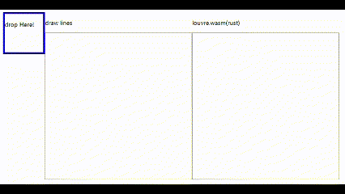
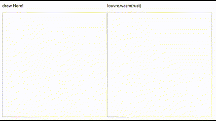

# Louvre: Computational Geometry Library with Rust  
  
This crate plans to handle computational geometry logics including processing polygons, lines and points, and some basic operations.  

## Triangulate *self-intersecting polygons*

Currently It has a triangulate logic in the polygon module. What is triangulation? Please refer to [mapbox/earcut.js](https://github.com/mapbox/earcut).
   
I widely refer to mapbox/earcut.js to implement basic logis and utilities. For further development, here the triangulate logic can handle ***self-intersecting polygons***, which is not viable in mapbox/earcut.js.
  
Handling 3d coordinates and complex polygons with holes inside is not implemented yet. 

### Use triangulate  
&nbsp; (in your cargo.toml)
```
[dependencies]
louvre = "0.1"
```
&nbsp; (in your .rs)
```
use louvre::polygon::triangulation::triangulate;

let new_data: Vec<f64>;
let indices: Vec<usize>;
(new_data, indices) = triangulate(&mut vec![-2.,0., 2.,0., 0.,2., 0.,-2.], 2);
```
  

### Visual Examples
Belows are visual examples of drawing polygons on html canvas using triangulate after compling it into .wasm.  
  
*fig1. Parsing .json file:* Triangulated polygon is portrayed on the right box. 
  
  
*fig2. Drawing random (self-intersecting) polygons:*


### Performance
Average performance time required for triangulate processing per item (in milliseconds).
||.rs|.wasm|
|------|---|---|
|hilbert|7.22|21.47|
|water2|7.24|26.48|
|inter1|0.|0.09|
|inter2|0.|0.13|
|inter3|0.|9.07|
|inter4|0.|0.13|

  
## Disclaimer
The original goal of this project was to use Rust to cover basic fundamental compuational geometry problems. The methods used here to enable triangulation of self-intersecing polygons would be quite useful for incorporating additional algoritms like boolean operations, however, at this moment further development is not tightly scheduled.  
  
## License
MIT