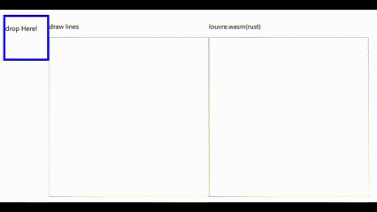

# Robust Triangulation with Louvre 🌙

[](https://crates.io/crates/louvre)
[](https://docs.rs/louvre)

▶️ [Live demo page](https://acheul.github.io/louvre) 

Louvre is a robust triangulation algorithm, which can handle self-intersecting polygons' triangulation.

What is triangulation? ["Polygon triangulation"](https://en.wikipedia.org/wiki/Polygon_triangulation) makes a polygon's vertex coordinates array
into a set of coordinates of triangles, whose areas' sum equals to the polygon's.

As most of computational graphic processing systems (like opengl/webgl)
handle polygons by decomposing them into triangles,
a good and fast triangulation algorithm is crucial.

Earcut([mapbox/earcut.js](https://github.com/mapbox/earcut)) is one of the most widely used triangulation algorithm.
However simple earcut cannot properly decompose self-intersecting polygons.

Louvre widely refered to mapbox/earcut.js to implement basic logics and utilities of simple earcut algorithm.
Making further contribution,
louvre can handle **self-intersecting polygons**, which is not viable in most open source algorithms including mapbox/earcut.js.

See [the live demo](https://acheul.github.io/louvre) of louvre. Try drawing some complex polygons, with self-intersecting lines.

Surely, louvre is FAST and ROBUST.
You can use this in rust native or rust supporting wasm environment.


## Ex
```rust
use louvre::triangulate;

let mut data: Vec<f64> = vec![
  [0., 0.], [0., 3.], [3., 0.], [3., 4.], [-1., 0.]
].concat();

let (new_data, indices) = triangulate(&mut data, 2);

assert_eq!(new_data, 
  vec![
    3.0, 0.0,  3.0, 4.0,  1.0, 2.0, 
    0.0, 0.0,  0.0, 1.0,  -1.0, 0.0,
    0.0, 1.0,  1.0, 2.0,  0.0, 3.0
  ]
);
assert_eq!(indices, vec![
  1, 2, 0, 
  4, 5, 3, 
  7, 8, 6
]);
```

</br>
Belows are visual examples of triangulating polygons on html canvas using rust's wasm.

*fig1. Parsing .json file:* Triangulated polygon is portrayed on the right box.
  
  
*fig2. Triangulating random (self-intersecting) polygons:*  


## Performance
Average performance time required for triangulate processing per item (in milliseconds).
||rust|wasm|
|------|---|---|
|hilbert|7.22|21.47|
|water2|7.24|26.48|
|inter1|0.|0.09|
|inter2|0.|0.13|
|inter3|0.|9.07|
|inter4|0.|0.13| 


## Unsafe linked list
There are lots of unsafe codes and raw pointers inside of this crate. They are used to implement linked list. For linked list in rust, using raw pointers is possibly the best (and fasted) option among others. The unsafe codes went through rust's miri test and they are designed to be safe.

## more?

Handling 3d coordinates and complex polygons with holes inside is not implemented yet.

The original goal of this project was to use Rust to cover basic compuational geometry problems. However at this moment further expansion is not tightly scheduled.

## Logs
* `v.0.2.0`
  * minor adjustement of module structure.
  * feature `html` added.
* `v.0.2.1`
  * minor interior modifications